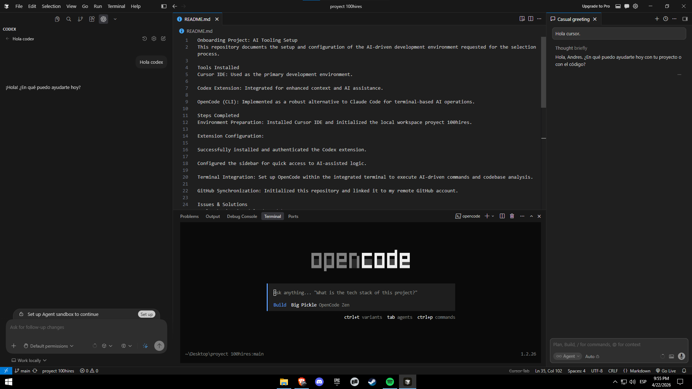

# Onboarding Project: AI Tooling Setup

This repository documents the setup and configuration of the AI-driven development environment requested for the selection process at 100Hires.

## Tools Installed
* **Cursor IDE**: Primary development environment.
* **Codex Extension**: Integrated for enhanced context and AI-assisted logic.
* **OpenCode (CLI)**: Implemented as a robust terminal-based AI orchestration tool.

## Steps Completed
1.  **Environment Preparation**: Initialized the local workspace `proyect 100hires` within Cursor IDE.
2.  **Extension Configuration**: 
    * Successfully installed and authenticated the **Codex** extension.
    * Configured the AI interface for seamless workflow integration.
3.  **Terminal Integration**: Set up **OpenCode** in the integrated terminal to manage codebase analysis via CLI.
4.  **GitHub Synchronization**: Initialized this repository and linked it to my remote GitHub profile.

## Issues & Solutions
* **Tool Adaptation (Claude Code replacement)**: 
    * *Issue*: Encountered access limitations with the Claude Code add-on.
    * *Solution*: Proactively implemented **OpenCode** as a functional alternative. This ensured the workflow requirements (AI terminal orchestration) were met without delays, demonstrating technical adaptability.
* **Git Command Syntax**:
    * *Issue*: Initial "Command not found" error when attempting to stage files using `git add.`.
    * *Solution*: Identified the syntax error (missing space) and corrected it to `git add .`, successfully staging the files for the initial commit.
* **Extension Initialization**:
    * *Issue*: The Codex extension required a manual refresh to trigger the login prompt.
    * *Solution*: Restarted the Extension Host in Cursor, which resolved the authentication flow.

## Proof of Work
Below is a screenshot of my workspace showing the active extensions and the terminal integration.

---
*Completed by Andrés Coronel*